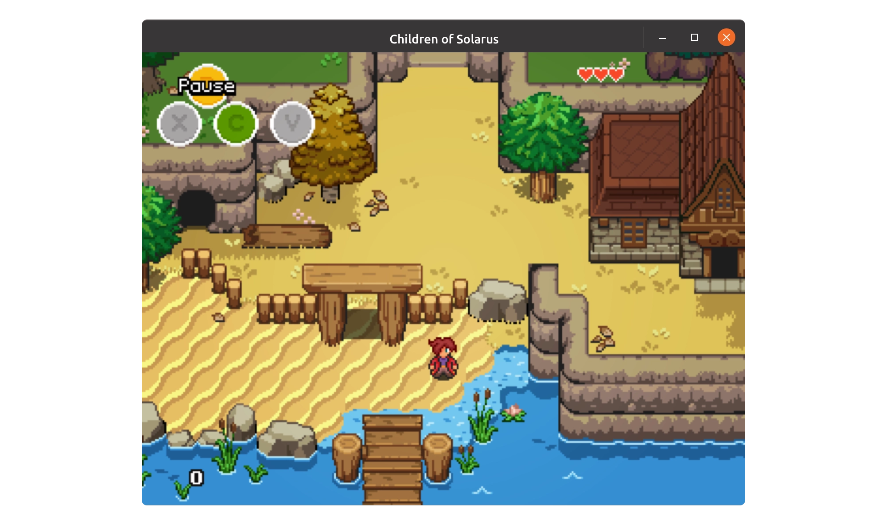

# Welcome to Solarus documentation

  

Solarus is a **free and open-source game engine** for **2D games**, licensed under GPL v3. It is written from scratch in C++ and uses SDL2.

This website features these sections:

- [**Tutorial**](tutorials/introduction.md): A step-by-step guide to create a game with Solarus.
- [**Lua API Reference**](lua-api/introduction.md): A reference of everything that Solarus offers to make your game.
- [**Files Specifications**](files-specs/introduction.md): The specification of the format of every file of your game.
- [**Resources**](resources/introduction.md): Useful resources (scripts, graphics, music, etc.) for your game.

