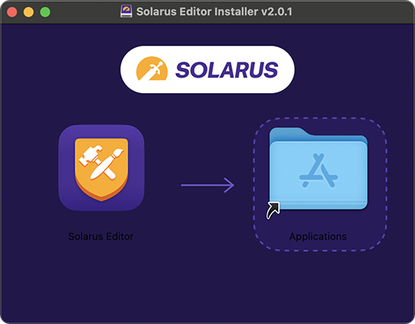

# Installing Solarus

## Download

You need first to install Solarus on your computer to be able to develop a game with it. Go to the [Solarus download page](https://www.solarus-games.org/download).


The first section shows the **developer installation packages**. This is what you need. Select your OS and click on the download button.

The second section is for players who just want to play games made with Solarus.

## Content of packages

| Component                         | Description                                                                                                   |
| --------------------------------- | ------------------------------------------------------------------------------------------------------------- |
| **Solarus**                       | The game engine itself.                                                                                       |
| **Solarus Run**                   | A Command-Line Interface to launch a quest.                                                                   |
| **Solarus Editor**                | The development environnement you'll use to create and edit the game's resources like maps, sprites or texts. |
| <nobr>**Solarus Launcher**</nobr> | An app to launch quests (intended for players).                                                               |
| **Sample Quest**                  | A very short Solarus quest, intended to be an example.                                                        |

### Windows

Currently, there is **no installer**. The package is just a Zip file containing all that you need. Unzip it to reveal its content. Note that you can move the `solarus/` folder where you want.


What you need to launch to start developing your Solarus quest is `solarus-editor.exe`. See how to do it in the next chapter.

!!! note

    This is what is called a _portable_ app: you can launch it from wherever you want. The downsides are that the app isn't perfectly integrated into the OS: you won't find it in the Start Menu, for instance. We're working on that.

### Linux

You can get Solarus as an **AppImage**. After downloading it, you need to make it executable.

On most Linux system, perform a right-click and go to _Properties_. You will be able to check an option called "Executable as Program" or something equivalent.

Otherwise, you can also execute the command:

For the editor:

```bash
chmod +x solarus-editor-v2.0.1-linux-x64.AppImage
```

For the launcher:

```bash
chmod +x solarus-launcher-v2.0.1-linux-x64.AppImage
```

Then double-click on the AppImage to launch the application.

### macOS

Open the DMG image you just downloaded to mount it. Drag and drop the Solarus Editor or Solarus Launcher icon to the Application folder to install it.
Now you are able to open Solarus apps by pressing <kbd>Cmd</kbd>+<kbd>Space</kbd> and type solarus in the Spotlight.


