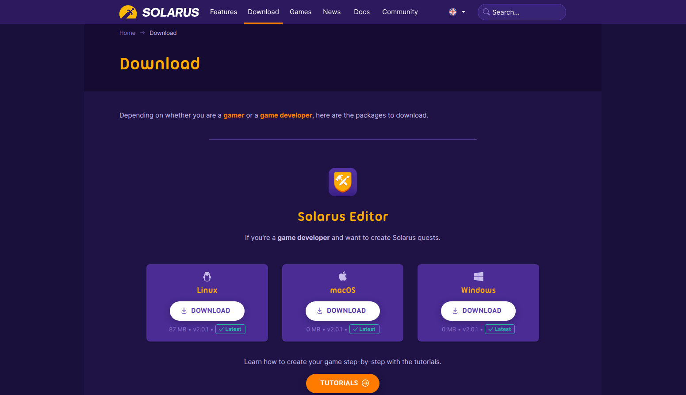
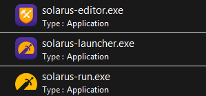
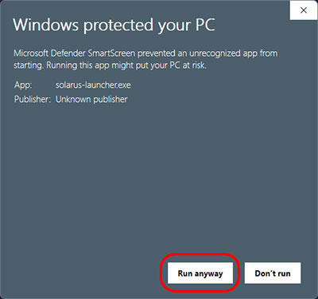
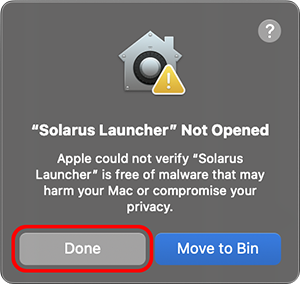
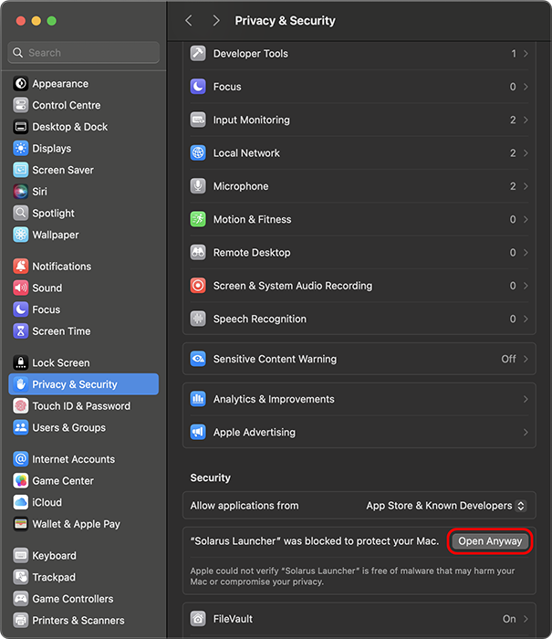
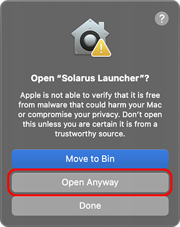

# Installing Solarus

## Download

You need first to install Solarus on your computer to be able to develop a game with it. Go to the [Solarus download page](https://www.solarus-games.org/download).

The first section shows the **developer installation packages**. This is what you need. Select your OS and click on the download button.

The second section is for players who just want to play games made with Solarus.

## Content of packages

| Component                         | Description                                                                                                   |
| --------------------------------- | ------------------------------------------------------------------------------------------------------------- |
| **Solarus**                       | The game engine itself.                                                                                       |
| **Solarus Run**                   | A Command-Line Interface to launch a quest.                                                                   |
| **Solarus Editor**                | The development environnement you'll use to create and edit the game's resources like maps, sprites or texts. |
| <nobr>**Solarus Launcher**</nobr> | An app to launch quests (intended for players).                                                               |
| **Sample Quest**                  | A very short Solarus quest, intended to be an example.                                                        |

### Windows

Currently, there is **no installer**. The package is just a Zip file containing all that you need. Unzip it to reveal its content. Note that you can move the `solarus/` folder where you want.

What you need to launch to start developing your Solarus quest is `solarus-editor.exe`. See how to do it in the next chapter.

!!! note

    This is what is called a _portable_ app: you can launch it from wherever you want. The downsides are that the app isn't perfectly integrated into the OS: you won't find it in the Start Menu, for instance. We're working on that.

**WARNING**

The first time you run solarus-editor.exe or solarus-launcher.exe, Windows will warn you about potential security issue. We can't remove this warning unless we buy an expensive signing license. For an open source free software, we find this isn't worth the investment and so, you just have to click on the _"More Info"_ link and then on _"Run anyway"_ to dismiss this message.

You won't have to do this again the next time you open the editor or the launcher until you download an update. That being said, be careful in general when installing software from untrusted sources. Be sure to always download Solarus Editor or Solarus Launcher from our official website **solarus-games.org**.

### Linux

You can get Solarus as an **AppImage**. After downloading it, just unzip the archive anywhere on your system. Then double-click on the AppImage to launch the application.

!!! warning

    As of today, we only supports Debian based Linux destributions. There is still crashes on Fedora or Manjaro systems that we are aware of. We are currently working on a fix. Until that moment, you can still build Solarus software from source by following instructions on the [Solarus repository](https://gitlab.com/solarus-games/solarus).

### macOS

Open the DMG image you just downloaded to mount it. Drag and drop the Solarus Editor or Solarus Launcher icon to the Application folder to install it.
Now you are able to open Solarus apps by pressing <kbd>Cmd</kbd>+<kbd>Space</kbd> and type solarus in the Spotlight.

**WARNING**

The first time you run Solarus Editor or Solarus Launcher, macOS will warn you about potential security issue. For now, we can't achieve to remove this security warning. To continue using, click on Done to remove the warning.

Then you need to go to your System Settings, Privacy & security. Scroll down until you see a section mentionning Solarus, click on "Open Anyway". You will need to confirm again (macOS is really picky) and click the "Open Anyway" button on the last warning message.

You won't have to do this again the next time you open the editor or the launcher until you download an update. That being said, be careful in general when installing software from untrusted sources. Be sure to always download Solarus Editor or Solarus Launcher from our official website **solarus-games.org**.
