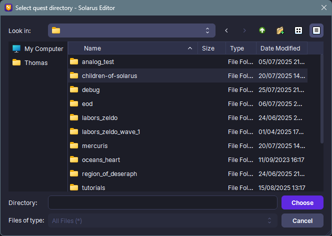

# Editing an existing quest

In this tutorial, you'll transition from player to game developer.
We'll see how to edit a game created with Solarus from the editor.

## Edit a .solarus game in the editor

When you download a game created with Solarus, in the vast majority of cases, you're downloading a file with the `.solarus` extension.
This isn't a special format, as this file is actually a **ZIP format** archive containing all the game source files.
So, if you rename the file to add the `.zip` extension, you'll be able to extract the game files and open them with **Solarus Editor**.

!!! note

    When extracting the game files, make sure to do so in a directory named `data` which itself will be in a directory dedicated to this game. This will make it easier to open it with the editor.

In Solarus Editor, go to the **File** menu and then **Load Quest**. Choose a directory for the game you want to edit. As mentioned earlier, the game directory must contain the directory named `data`.

You now have access to all the resources that make up the game. You can browse scripts, sprites, and maps, make changes, and even play the game.

## Importing resources to my project

By extracting the files from the `.solarus` archive, you can import resources from this game into your own project. This can help you create prototypes or build your own game.

!!! warning

    When importing resources from other Solarus quests, be sure to respect the licenses and contact the authors to obtain their permission. If applicable, credit them in your creation.

## How to protect my own game from editing?

It is **not possible** to protect your game source code. Solarus philosophy is very open; we are convinced that it has more advantages than disadvantages.

We see several arguments for this:

- Even if Solarus offered a way to protect your game source code, no system can prevent someone highly motivated from accessing it.
- The overwhelming majority of players are not interested in looking the hidden mechanics of your game. Those who download it just want to play.
- If some people who have downloaded your game access it with Solarus Editor, they will undoubtedly be very interested in learning how you created a particular part, and this can be **very inspiring** and motivate them to create their own games.

On the other hand, if you want your game resources to be protected from copyright, you can for example use proprietary licenses by indicating this for each resource in the editor.

For more information, [read the article on choosing a license](./choosing-a-license.md).
