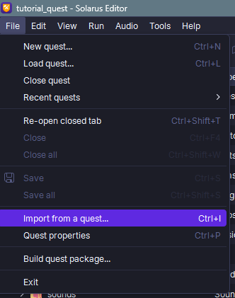
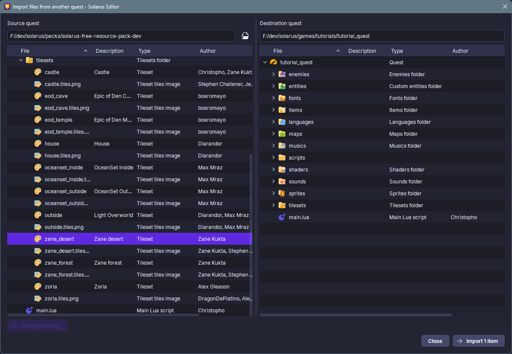
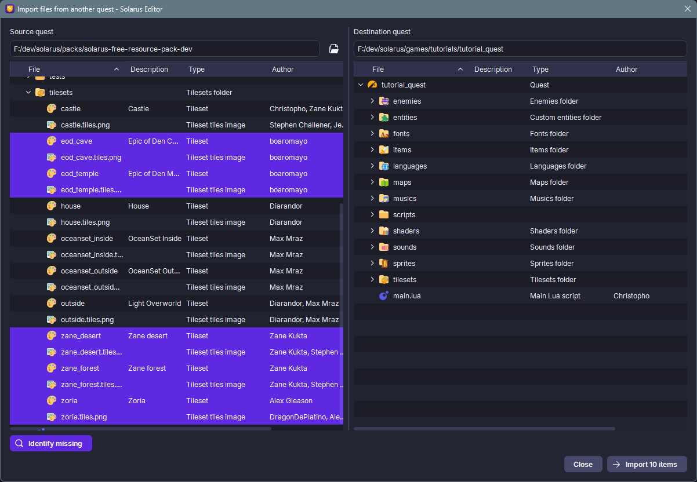

# Importing resources

## What is a resource pack?

You can import resources into your quest from another quest, or even from a **resource pack**.
Resource packs are special Solarus projects that aren't playable, but are collections of files (tilesets, sprites, scripts, sounds, music, etc.).

Here you can access the resource packs made available to creators:

- [Resource packs](../../resources/resource-packs.md)

"Free" resource packs are hosted on Gitlab repositories. For each pack, you can:

- Click on the "Code" button and then download the source files in compressed archive format (zip, tar, etc.).
- Clone the repository if you use Git on your system.

Once the pack files are downloaded/extracted, you will see a "data" directory, similar to the playable Solarus quests.

## How to import?

From the Solarus Editor, once your quest is open, go to the **File** menu and then **Import from Quest**.
A window will open containing two panels. On the left is the source quest, the one you want to import from.
On the right is the destination quest, your quest.

Select the resources you want to import in the left panel and then click the **Import items** button.

It might seem like the editor only copies the files from the resource pack to your quest, but it also copies the metadata associated with the resources, including the authors and licenses for each imported resource.

## Identify missing resources

You can identify and preselect the resources in the pack by clicking the **Identify missing** button in the bottom left corner. This will select any resources not included in your quest and make them available for import.

You can also select a directory in the resource pack and click **Identify missing** to select only the missing resources in that directory.

## Limitations

There are two limitations to this system:

- If you have renamed or moved a resource imported into your quest and you use **Identify missing**, the system will not be able to detect this change and will still select the resource from the pack.
- If there is a modification or update to a resource in the pack you imported, the **Identify missing** system will not be able to detect this and will not select the updated resource. To work around this, delete the resource from your quest and then re-import it.
