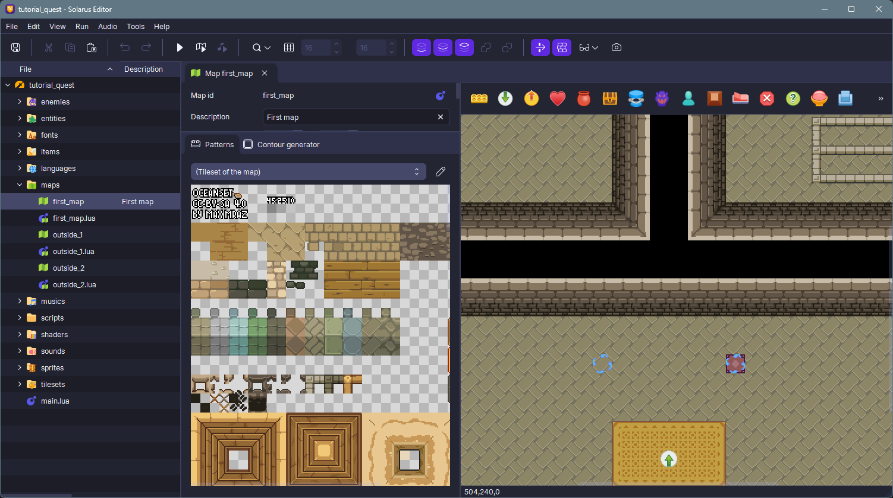
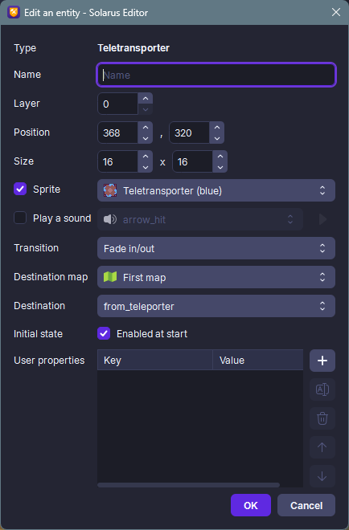
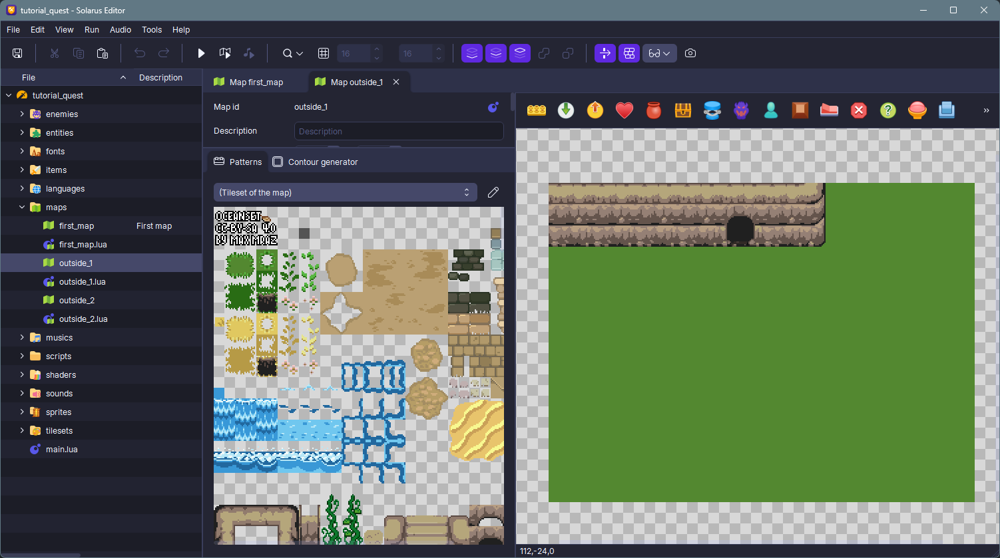
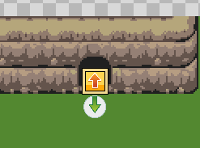
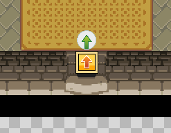
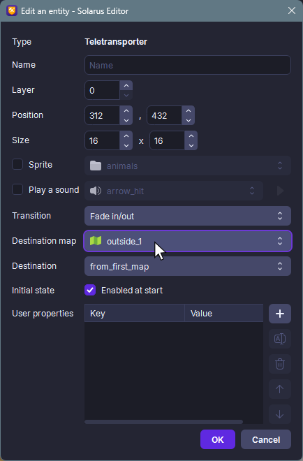
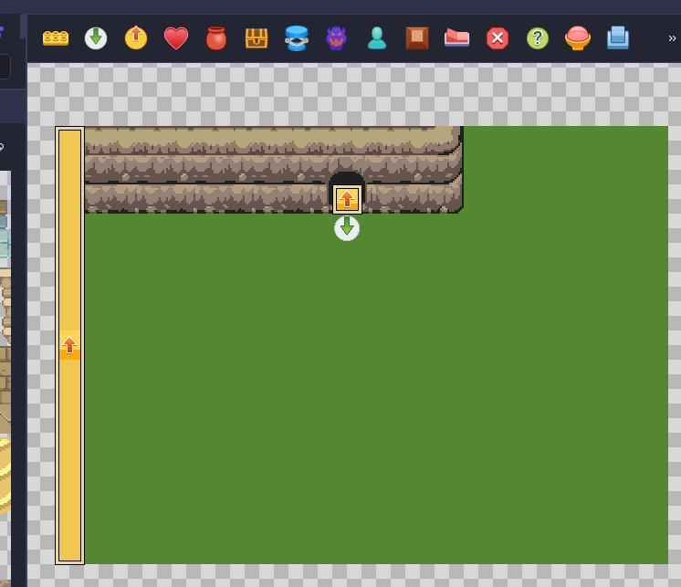
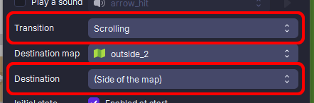

# Teletransporters

In this article, we'll see how to transport the hero from one location to another. The hero can travel from one point to another on the same map or on a different map. We'll use the teletransporter entity and place it on a map.

## Teleport in the same map

Click the **Add Teletransporter** icon in the **entity toolbar** when editing a map, then place the teletransporter somewhere on it. You can edit the sprite of this teletransporter by pressing <kbd>Enter</kbd> or double-clicking on it, then check the "Sprite" checkbox and choose a sprite from the list of those present in your project.

Then add a **Destination entity** and place it elsewhere on the map. Here too, you can apply a sprite to this destination if you wish. This entity will then be the destination of the teleportation.

!!! note

    Give your entities meaningful and clear names, especially for destinations. This is the name you'll see when you select a teletransporter destination.

For the destination you just created, a good practice is to name it `from_xxx`, where `xxx` is the name of your teletransporter (or a map it's from if one exists). Here we'll call the destination `from_teleporter`.

Then edit the teletransporter entity and choose the destination you just created.

Test your map and then move the hero towards the teletransporter to see the teleportation in action. It comes with a fade transition that you can change in the teletransporter properties.

!!! note

    At the end of the teleport, the hero will be facing the same direction as the destination entity. Therefore, you can change the entity direction as you wish. The special value "Keep the same direction" allows you to turn the hero in the same direction as when entering the teletransporter.

You can also play a sound at the time of teleportation, to do this, choose a sound from the drop-down list in the properties of the teletranspoter entity.

## Teleport to another map

If you want to teleport the hero to another map, proceed in the same way as for teleporting on the same map but when choosing the destination, you will have to specify the destination map that corresponds to the destination entity.

Let's imagine we have an outdoor map, we will create a door that allows travel from the inside to the outside and vice versa.

Outside map:

Inside map:

Next, place the teletransporter and destination entities, but don't necessarly apply sprites to them if the door design is done with tiles.
Here again, we recommend naming the destination entities carefully so you don't get lost when choosing the destination for the teletransporter entities.

!!! note

    When renaming a destination entity, checking the "Update existing teletransporter" checkbox ensures that all teletransporters leading to that destination continue to function and are updated in all maps where they are located.

So, select the destination map in the teletransporter properties and the destination entity (here `from_first_map`).
Do the same for the teletransporter on the outside map, but select the destination of the door located in the inside map.

!!! note

    When testing your map, you can make changes without leaving the game; just leave the map and come back to see the changes. This is useful for testing.

## Scrolling transitions

Now let's look at a specific type of transition: the scrolling transition. With this style of transition, you can achieve a scrolling effect between two adjacent maps, like in many 2D Zelda-like games.

The idea is to place a teletransporter entity along the edge of your map. Select the teletransporter and press <kbd>R</kbd> or right-click and select "Resize" to change its size. It should be located just outside the map and have a thickness that matches the hero's size (usually 16 pixels).

Open the teletransporter properties and choose the destination map that matches the adjacent map, then change the transition type to "Scrolling." Finally, choose the destination, which will not be a destination entity but the **edge of the map** the hero will go to. This will preserve the hero's position on the next map.

Do the same on the adjacent map so that the hero can return to the previous one with the same transition.
