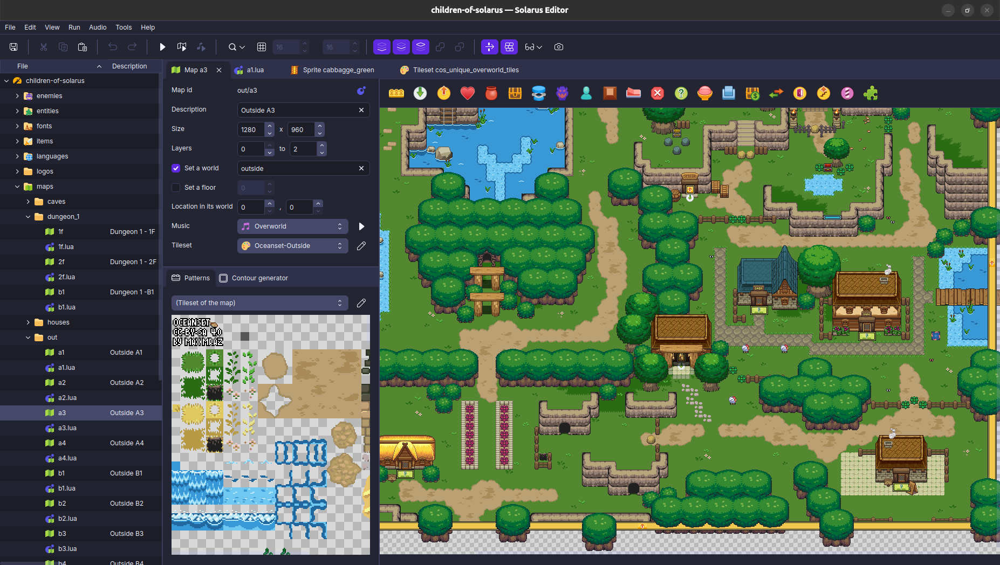

<div align="center" style="margin-bottom: 3em;">

</div>

# Solarus Editor

[](https://www.gnu.org/copyleft/gpl.html)

**Solarus Editor** is a graphical user interface to create, modify and run
quests for the [Solarus engine](https://gitlab.com/solarus-games/solarus).

This software is written in C++ with Qt.

<div align="center" style="padding: 1em;">
  <a href="screenshot.png">
    
  </a>
</div>

## Compilation Instructions

### Dependencies

To build Solarus Editor, you need:

- A C++ compiler with support of C++11 (gcc 4.8 and clang 3.4 are okay).
- CMake 3.10 or greater.
- Solarus and its dependencies:
  - SDL2 (2.0.18 or greater)
  - SDL2_image
  - SDL2_ttf
  - OpenGL
  - GLM
  - OpenAL
  - vorbisfile
  - modplug (0.8.8.4 or greater)
  - lua5.1 or luajit (LuaJIT is recommended)
  - physfs
- Qt version 6.8 or higher.

Be sure to build and install `solarus` before building `solarus-editor`:

```bash
cd solarus
mkdir build
cd build
cmake ..
sudo make install
```

[Read the detailed instructions](../compilation.md) to build `solarus`

#### macOS

Installing Qt6 on macOS is easy by using [Homebrew](https://brew.sh/) with the following package:

```bash
brew install qt@6
```

#### Linux

On Debian or derivatives, we strongly recommend to use [online installer from Qt](https://www.qt.io/download-qt-installer-oss) to get the latest version. Following debian packages are not supported on Debian LTS distributions. You can still install them if your Linux distribution provides them in version 6.8 or higher:

```bash
sudo apt update
sudo apt install --no-install-recommends \
  qt6-base-dev \
  qt6-base-dev-tools \
  qt6-tools-dev \
  qt6-tools-dev-tools \
  qt6-l10n-tools \
  libqt6opengl6-dev \
  libqt6svg6-dev
```

#### Windows (MSYS2)

On Windows, using UCTR64 environment, you can install the Qt6 framework with this command:

```bash
pacman --noconfirm --needed -S \
  mingw-w64-ucrt-x86_64-qt6-base \
  mingw-w64-ucrt-x86_64-qt6-svg \
  mingw-w64-ucrt-x86_64-qt6-tools
```

### With Qt Creator

In Qt Creator, you can load the `solarus-editor` project by opening the
`CMakeLists.txt` file.

If Solarus is installed in a standard paths known by CMake, it should directly
work. Otherwise, you need to set CMake variables indicating the location of the
`solarus` includes and libraries. See the example in the command-line section
below.

### With the command line

If you don't want to use Qt Creator, you can build the project from the
command line using CMake.

#### Configure

```bash
cd editor
mkdir build
cd build
cmake ..
```

If CMake fails to find Solarus included directories or libraries,
for example because they are not properly installed in the standard paths,
you can explictly indicate their location instead:

```bash
cmake \
  -DSOLARUS_INCLUDE_DIR="/path/to/solarus/include" \
  -DSOLARUS_LIBRARY="/path/to/solarus/libsolarus.so" \
  .. \
```

#### Build

```bash
make
```

#### Run

```bash
./solarus-editor
```

## License

The source code of Solarus Quest Editor is licensed under the terms of the
[GNU General Public License v3](https://www.gnu.org/licenses/gpl-3.0.en.html).

Images used in the editor are licensed under
[Creative Commons Attribution-ShareAlike 3.0 (CC BY-SA 3.0)](
http://creativecommons.org/licenses/by-sa/3.0/).

See the `license.md` file for more details.
