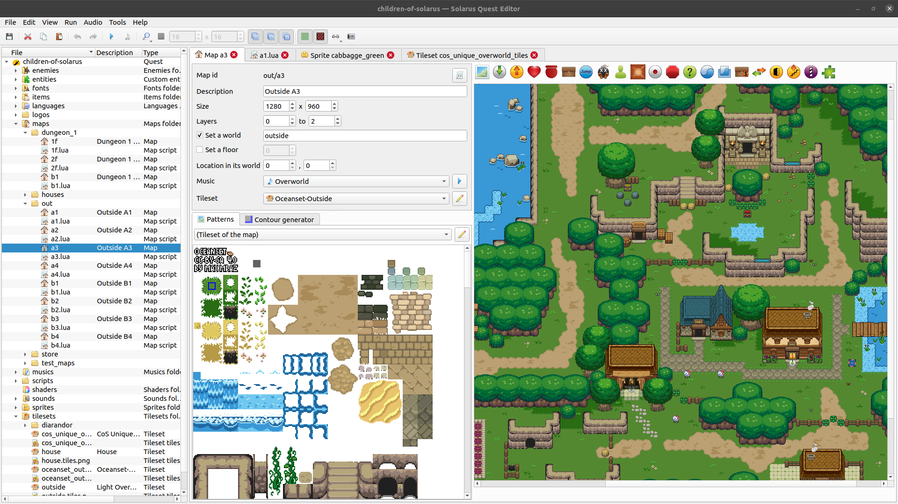

<div align="center" style="margin-bottom: 3em;">

</div>

# Solarus Quest Editor

[](https://travis-ci.org/solarus-games/solarus-quest-editor) [](https://www.gnu.org/copyleft/gpl.html)

**Solarus Quest Editor** is a graphical user interface to create, modify and run
quests for the [Solarus engine](https://gitlab.com/solarus-games/solarus).

This software is written in C++ with Qt.

<div align="center" style="padding: 1em;">
  <a href="screenshot.png">
    
  </a>
</div>

## Compilation Instructions

### Dependencies

To build Solarus Quest Editor, you need:

- A C++ compiler with support of C++11 (gcc 4.8 and clang 3.4 are okay).
- CMake 3.10 or greater.
- Qt 6.8 or greater.
  - Debian qt6 packages required:
    - qt6-base-dev
    - qt6-base-dev-tools
    - qt6-tools-dev
    - libqt6opengl6-dev
    - libqt6svg6-dev
- Solarus and its dependencies:
  - SDL2 (2.0.18 or greater)
  - SDL2_image
  - SDL2_ttf
  - OpenGL
  - GLM
  - OpenAL
  - vorbisfile
  - modplug (0.8.8.4 or greater)
  - lua5.1 or luajit (LuaJIT is recommended)
  - physfs

We always keep branch `dev` of `solarus-quest-editor` compatible with branch
`dev` of `solarus`.

Be sure to build and install `solarus` before building `solarus-quest-editor`. You may need to clone `solarus` repository before.

```bash
cd solarus
mkdir build
cd build
cmake ..
sudo make install
```

### With Qt Creator

In Qt Creator, you can load the `solarus-quest-editor` project by opening the
`CMakeLists.txt` file.

If Solarus is installed in a standard paths known by CMake, it should directly
work. Otherwise, you need to set CMake variables indicating the location of the
`solarus` includes and libraries. See the example in the command-line section
below.

### With the command line

If you don't want to use Qt Creator, you can build the project from the
command line using CMake.

#### Configure

```bash
cd solarus-quest-editor
mkdir build
cd build
cmake ..
```

If CMake fails to find Solarus include directories or libraries,
for example because they are not properly installed in standard paths,
you can explictly indicate their location instead:

```bash
cmake \
  -DSOLARUS_INCLUDE_DIR="/path/to/solarus/include" \
  -DSOLARUS_LIBRARY="/path/to/solarus/libsolarus.so" \
  .. \
```

#### Build

```bash
make
```

#### Run

```bash
./solarus-quest-editor
```

### Adding Documentation

The Solarus Quest Editor supports offline documentation,
but does not currently build or install it itself. Use `doxygen` with the
[solarus-doc](https://gitlab.com/solarus-games/solarus-doc) repository to
create the documentation. Everything in the `<version>/html/` directory should
be copied to `assets/doc/`.

## License

The source code of Solarus Quest Editor is licensed under the terms of the
[GNU General Public License v3](https://www.gnu.org/licenses/gpl-3.0.en.html).

Images used in the editor are licensed under
[Creative Commons Attribution-ShareAlike 3.0 (CC BY-SA 3.0)](
http://creativecommons.org/licenses/by-sa/3.0/).

See the `license.md` file for more details.
