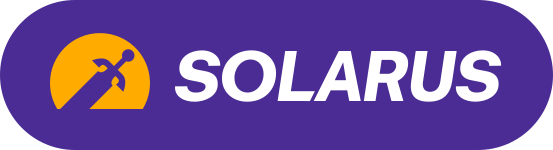
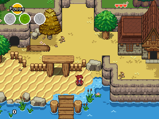

# Solarus

**Solarus** is a free and open-source 2D game engine written in C++, that can run games scripted in Lua. It has been designed with 16-bit classic Action-RPGs in mind, and is available on a wide range of platforms.

You'll find more information about Solarus on <https://www.solarus-games.org>, such as downloads, games, news, tutorials and more.

| Application                  | Description                  |
| ---------------------------- | ---------------------------- |
| `solarus`                    | The C++ library.             |
| `solarus-run`                | CLI to play Solarus games.   |
| [Solarus Launcher](launcher) | GUI to play Solarus games.   |
| [Solarus Editor](editor)     | GUI to create Solarus games. |

[launcher]: https://gitlab.com/solarus-games/solarus-launcher-legacy
[editor]: https://gitlab.com/solarus-games/solarus-quest-editor

## Compilation

To compile Solarus, instructions can be found in the [compilation.md](compilation.md) file.

## Create your own game

See [tutorials](https://docs.solarus-games.org/) (video and text), and [documentation](https://doxygen.solarus-games.org/latest) on Solarus website.

## License

The source code of Solarus is licensed under the terms of the [GNU GPL v3](https://www.gnu.org/copyleft/gpl.html).

Resources made for Solarus are licensed under the terms of the [CC BY-SA 3.0](http://creativecommons.org/licenses/by-sa/3.0) and [CC BY-SA 4.0](http://creativecommons.org/licenses/by-sa/4.0).

## Donate

Solarus is backed by [Solarus Labs](https://www.solarus-games.org/about/legal-terms/), a nonprofit organization under French law. All your donations will be totally reinvested into the project.

